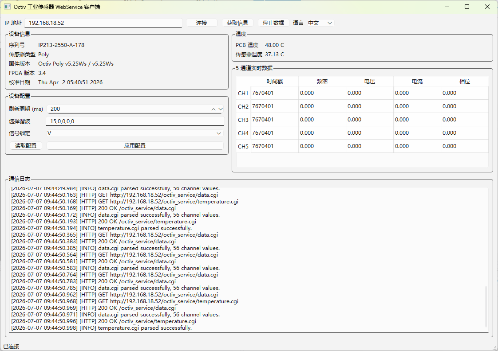
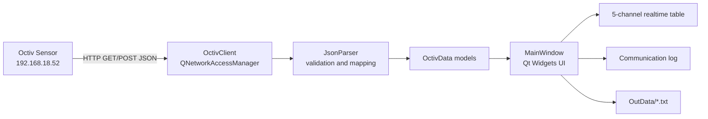

# Octiv Industrial Sensor WebService Client v1.1

Qt 6 Widgets based industrial host-computer client for Octiv Sensor devices. The application communicates with the sensor through HTTP REST APIs, parses JSON responses, displays device status and five-channel realtime measurement data, and records captured data to TXT files.



## Version

Current release: **v1.1**

Main v1.1 updates:

- Fixed temperature parsing for the actual device response fields:
  - `Board` -> PCB temperature
  - `Sensor` -> Sensor temperature
- Added `timestamp` column before `frequency` in the realtime data table.
- Added TXT recording from Start Data to Stop Data.
- Added automatic `OutData` folder creation.
- Debug build writes data to the source folder beside `main.cpp`.
- Release build writes data to the folder beside `OctivClient.exe`.
- Added Chinese/English UI switching.

## Target Device

Default Octiv Sensor address:

```text
192.168.18.52
```

Local host example:

```text
192.168.18.53
```

Protocol:

```text
HTTP REST + JSON
```

## Supported APIs

| API | Method | Purpose |
|---|---|---|
| `/octiv_service/info.cgi` | GET | Read serial number, sensor type, firmware, FPGA revision and calibration date |
| `/octiv_service/config.cgi` | GET | Read refresh rate, selected harmonics and signal lock |
| `/octiv_service/config.cgi` | POST | Update refresh rate, selected harmonics and signal lock |
| `/octiv_service/temperature.cgi` | GET | Read PCB and sensor temperature |
| `/octiv_service/data.cgi` | GET | Read realtime timestamp, frequency, voltage, current and phase |
| `/octiv_service/ionfluxparams.cgi` | GET/POST | Read or update Ion Flux parameters |

## Runtime Data Output

When the user clicks **Start Data**, the client creates a TXT file and appends five-channel realtime data until **Stop Data** is clicked.

Output folder rules:

| Build type | Output folder |
|---|---|
| Debug | `OctivClient/OutData` beside `main.cpp` |
| Release | `OutData` beside `OctivClient.exe` |

File name format:

```text
<device-name>_<yyyyMMdd_HHmmss>.txt
```

Example:

```text
IP213-2550-A-178_20260707_094448.txt
```

TXT columns:

```text
Timestamp    Channel    Frequency    Voltage    Current    Phase
```

## Architecture



## Project Structure

```text
OctivClient/
├── main.cpp
├── MainWindow.ui
├── MainWindow.cpp
├── MainWindow.h
├── network/
│   └── OctivClient.h/.cpp
├── model/
│   └── OctivData.h
├── parser/
│   └── JsonParser.h/.cpp
├── utils/
│   └── Logger.h/.cpp
├── OutData/
│   └── .gitkeep
├── docs/
│   ├── SourceCode_LineByLine.md
│   └── images/
│       └── octiv-client-v1.1-ui.png
└── releases/
    └── OctivClient_Release.zip
```

## Build Requirements

- Windows 10/11
- Visual Studio 2022 MSVC x64
- Qt 6.7.3 MSVC 2022 64-bit
- CMake 3.16+
- Ninja

Qt path used by the provided presets:

```text
C:/Qt/6.7.3/msvc2022_64
```

## Build Commands

Debug:

```bat
cd /d C:\Users\艾兰科技\Desktop\WJC\WJC_Program\OctivClient
call "C:\Program Files\Microsoft Visual Studio\2022\Community\VC\Auxiliary\Build\vcvars64.bat"
"C:\Program Files\Microsoft Visual Studio\2022\Community\Common7\IDE\CommonExtensions\Microsoft\CMake\CMake\bin\cmake.exe" -S . -B out\build\x64-debug -G Ninja -DCMAKE_BUILD_TYPE=Debug -DCMAKE_PREFIX_PATH=C:/Qt/6.7.3/msvc2022_64 -DCMAKE_DISABLE_FIND_PACKAGE_WrapVulkanHeaders=ON
"C:\Program Files\Microsoft Visual Studio\2022\Community\Common7\IDE\CommonExtensions\Microsoft\CMake\CMake\bin\cmake.exe" --build out\build\x64-debug --config Debug --target OctivClient
```

Release:

```bat
cd /d C:\Users\艾兰科技\Desktop\WJC\WJC_Program\OctivClient
call "C:\Program Files\Microsoft Visual Studio\2022\Community\VC\Auxiliary\Build\vcvars64.bat"
"C:\Program Files\Microsoft Visual Studio\2022\Community\Common7\IDE\CommonExtensions\Microsoft\CMake\CMake\bin\cmake.exe" -S . -B out\build\x64-release -G Ninja -DCMAKE_BUILD_TYPE=Release -DCMAKE_PREFIX_PATH=C:/Qt/6.7.3/msvc2022_64 -DCMAKE_DISABLE_FIND_PACKAGE_WrapVulkanHeaders=ON
"C:\Program Files\Microsoft Visual Studio\2022\Community\Common7\IDE\CommonExtensions\Microsoft\CMake\CMake\bin\cmake.exe" --build out\build\x64-release --config Release --target OctivClient
```

## Usage

1. Connect the PC and Octiv Sensor to the same network segment.
2. Set the target IP address. The default is `192.168.18.52`.
3. Click **Connect** to initialize device info, config and temperature.
4. Click **Get Info** if device metadata needs to be refreshed.
5. Click **Start Data** to poll realtime data and start TXT recording.
6. Click **Stop Data** to stop polling and close the TXT output file.

## HTTP Error Handling

The client logs all HTTP requests and handles common response statuses:

| Status | Meaning |
|---|---|
| 200 | OK |
| 400 | Bad Request |
| 401 | Unauthorized |
| 404 | Not Found |
| 405 | Method Not Allowed |
| 429 | Rate Limit Exceeded |
| 500 | Internal Error |

## Documentation

Detailed source walkthrough:

[docs/SourceCode_LineByLine.md](docs/SourceCode_LineByLine.md)

## License

Internal industrial tool project. Add a license file before public redistribution if needed.
