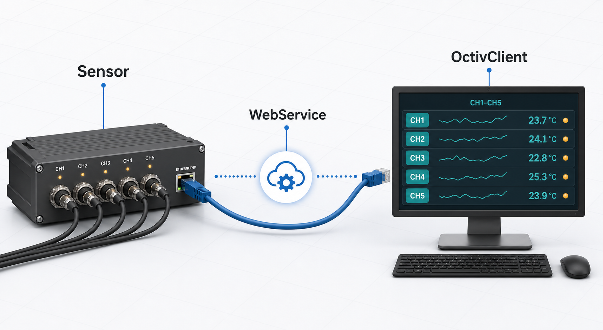
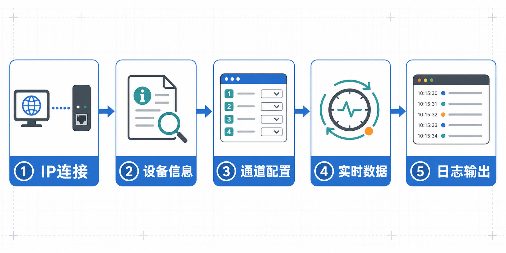

# OctivClient v1.1 版本介绍

## 项目概览

OctivClient v1.1 是一个基于 Qt 6 Widgets 的工业传感器 WebService 客户端。它面向需要在 Windows 桌面环境中调试、读取和观察 Octiv 工业传感器数据的场景，提供了设备连接、信息读取、配置下发、实时数据展示和日志追踪等常用能力。


主界面采用工程调试软件常见布局：顶部负责连接和基础操作，左侧集中显示设备信息与配置项，右侧显示温度和五通道实时数据，底部保留大面积通信日志，方便在现场调试时连续观察请求、响应和异常状态。

## 架构说明



程序主要由四类代码组成：

- `MainWindow`：负责界面初始化、按钮事件、语言切换、数据刷新和用户操作反馈。
- `OctivClient`：负责设备地址管理、HTTP 请求发送、超时处理、自动重连和连接状态通知。
- `JsonParser`：负责将设备返回的 JSON 数据解析为结构化数据。
- `OctivData`：定义设备信息、配置、温度、通道数据和离子通量参数等数据模型。

这种拆分让界面逻辑、网络通信、JSON 解析和数据模型保持相对独立，后续如果需要增加接口或扩展字段，可以优先在网络层和解析层补充，而不必大幅改动主窗口。

## 典型工作流程



1. **IP 连接**：输入设备 IP 地址，客户端构造 WebService 访问地址并尝试连接。
2. **设备信息**：读取序列号、传感器类型、固件版本、FPGA 版本和校准日期等字段。
3. **通道配置**：读取或设置刷新周期、CH1-CH5 谐波选项和信号锁定模式。
4. **实时数据**：按设定周期轮询传感器数据，刷新频率、电压、电流和相位等测量值。
5. **日志输出**：记录连接、请求、响应和错误信息，辅助定位网络或设备侧问题。

## 功能细节

### 设备连接

默认设备地址为 `192.168.18.52`。用户可以在界面顶部输入实际设备 IP，点击“连接”后，程序会通过网络模块建立后续请求所需的主机地址。

网络层提供了连接状态信号，主窗口会根据连接状态更新界面提示。网络模块还包含自动重连逻辑，用于在现场调试时降低短暂网络波动带来的影响。

### 设备信息读取

设备信息区域展示以下字段：

- 序列号
- 传感器类型
- 固件版本
- FPGA 版本
- 校准日期

这些字段由 WebService 返回的 JSON 数据解析得到。解析失败时，日志区会显示对应错误，避免界面静默失败。

### 配置读写

设备配置区域包含：

- 刷新周期，单位为 ms
- CH1-CH5 谐波选项
- 信号锁定模式

用户可以先点击“读取配置”获取设备当前配置，再根据现场需求修改参数并点击“应用配置”。配置下发后，程序会保留最后一次提交的配置状态，用于后续结果核对和界面更新。

### 实时数据与温度

实时数据表格按 CH1-CH5 展示五个通道的测量值，包含：

- 时间戳
- 频率
- 电压
- 电流
- 相位

温度区域展示 PCB 温度和传感器温度。实时轮询由 `QTimer` 驱动，刷新周期来自配置区域，便于现场根据设备响应速度和数据需求调整采集节奏。

### 日志与数据记录

底部通信日志用于显示程序运行过程中的状态信息，包括连接结果、请求类型、HTTP 状态、解析结果和错误信息。日志输出由 `Logger` 统一管理，便于后续扩展到文件日志或更细的日志等级。

## 构建与运行

推荐环境：

- Windows 10/11
- Qt 6.11.1 MSVC 2022 64-bit
- Visual Studio 2022 或兼容 MSVC 工具链
- CMake 3.16+

常用构建命令：

```powershell
cmake -S . -B out/build/x64-release -G Ninja -DCMAKE_BUILD_TYPE=Release -DCMAKE_PREFIX_PATH=D:/Programs/Qt/6.11.1/msvc2022_64
cmake --build out/build/x64-release --config Release --target OctivClient
```

如果从 Visual Studio 打开项目，可直接选择 `x64-Release` 或 `x64-Debug` preset。项目已在 CMake 中为 Visual Studio 调试环境补充 Qt `bin` 路径，降低运行时找不到 Qt DLL 的概率。

## v1.1 版本内容

- 修正复制项目后 Qt6 路径失效导致 CMake 无法找到 `Qt6Config.cmake` 的问题。
- 将构建配置更新到本机 Qt 6.11.1 MSVC 2022 64-bit 环境。
- 增加 CMake 兜底查找逻辑，优先使用 `QTDIR`，再尝试本机 Qt 安装目录。
- 增加 Visual Studio 调试运行环境中的 Qt DLL 路径。
- 清理构建缓存、旧 qmake 工程文件、历史说明缓存和旧发布包。
- 重新生成 v1.1 版本介绍文档和发布压缩包。

